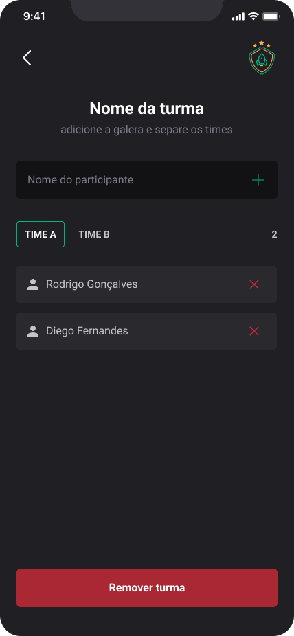

<h1 align="center">
     <a href="#" alt="sistema web igniteFeed"> Ignite Teams </a>
</h1>

<h3 align="center">
    ✔ Projeto para controle de times utilizando react-native, styled Components e armazenamento Local.
</h3>

<h4 align="center">
	🚧 Concluído 🚀 🚧
</h4>

# Tabela de conteúdos

<!--ts-->

- [Sobre o projeto](#-sobre-o-projeto)
- [Funcionalidades](#-funcionalidades)
- [Layout](#-layout)
  - [Mobile](#mobile)
- [Como executar o projeto](#-baixando-e-executando)
- [Tecnologias](#-tecnologias)
- [Como contribuir no projeto](#-como-contribuir-no-projeto)
- [Autor](#-autor)
<!--te-->

## 💻 Sobre o projeto

📩 Ignite Teams - é um projeto para controle de times utilizando react-native, styled Components e armazenamento Local.

---

## ⚙️ Funcionalidades

- [x] Os usuários tem acesso ao sistema, onde podem:
  - [x] Criar novos times
  - [x] Criar players
  - [x] Remover players
  - [x] Remover times
  - [x] Filtrar players por times e grupos

---

## 🎨 Layout

O layout da aplicação está disponível no Figma:

### Mobile
<p align="center">
  
 
 
</p>

---

## 🛠 Tecnologias

As seguintes ferramentas foram usadas na constução do projeto:

- [JavaScript]
- [React Native]
- [TypeScript]
- [Styled-Components]

---

## 🧭 Baixando e executando

Antes de começar, você vai precisar ter instalado em sua máquina as seguintes ferramentas:
[Git](https://git-scm.com), [Node.js](https://nodejs.org/en/) e o [Expo](https://expo.dev/).
Além disto é bom ter um editor para trabalhar com o código como [VSCode](https://code.visualstudio.com/)

```bash

# Clone este repositório
$ git clone https://github.com/mguibtech/igniteteams.git

# Acesse a pasta do projeto no terminal/cmd
$ cd igniteteams

# Instale as dependências
$ npm install
ou
$ npm i

# Execute a aplicação em modo de desenvolvimento
$ npm run android/iox
ou
$ yarn android/ios

```

---

## 💪 Como contribuir no projeto

1. Faça um **fork** do projeto.
2. Crie uma nova branch com as suas alterações: `git checkout -b my-feature`
3. Salve as alterações e crie uma mensagem de commit contando o que você fez: `git commit -m "feature: My new feature"`
4. Envie as suas alterações: `git push origin my-feature`
   > Caso tenha alguma dúvida confira este [guia de como contribuir no GitHub](https://medium.com/@lcnogueira/um-guia-para-contribui%C3%A7%C3%A3o-em-projetos-open-source-no-github-46a423e4e9b3)

---

### 🦸 Autor

<a href="https://www.linkedin.com/in/marcos-guibson-santos-da-silva-0b62321a3/">
 
 <br />
 <sub><b>Marcos Guibson</b></sub></a> <a href="https://www.linkedin.com/in/marcos-guibson-santos-da-silva-0b62321a3/" title="mguibtech">🚀</a>

Feito com ❤️ por Marcos Guibson 👋🏽 Entre em contato!

[](https://www.linkedin.com/in/marcos-guibson-santos-da-silva-0b62321a3/)
[](mailto:mguibtech@gmail.com)
